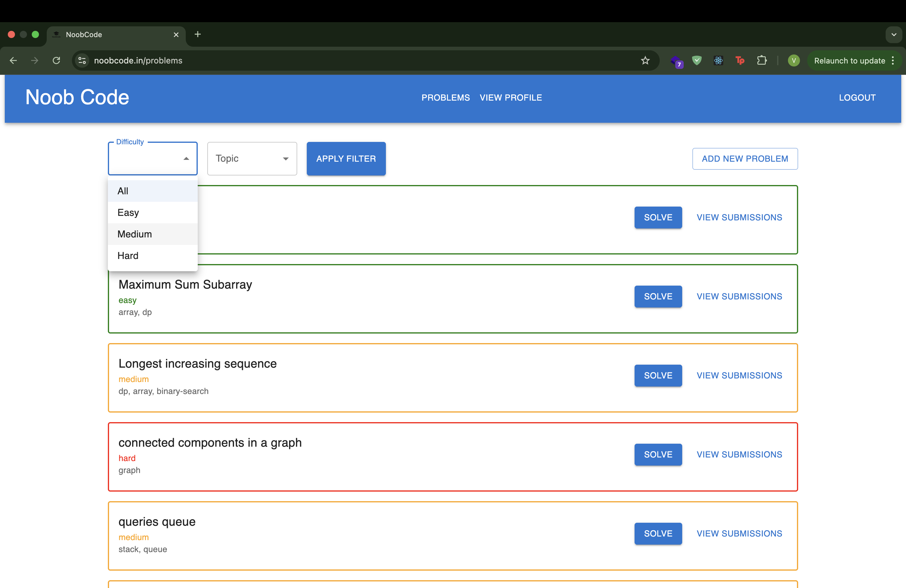

About the Project
• Developed a beginner-focused Online Judge platform that is capable of writing
code in a code editor and generating verdicts after compilation and execution
by implementing a microservice architecture.
• Integrated AI-powered debugging, complexity analysis, and code quality
feedback using Google Gemini 2.0 API to help new programmers build good
coding habits early.
• Built the online compiler for Java and C++ which is easily scalable to add
more languages.
• Used Docker to containerise the compiler service to create a secure
environment for code execution and to ensure portability.
• Additional features include – Adding problems and testcases, JWT-based
authentication and authorisation, complete submission history with submitted
code using Express, user performance tracking analytics page, mirrorcode’s
code editor, and problem filters by difficulty and topics using React.
• Deployed the compiler service on AWS EC2, backend with other functionalities
on Render, and frontend on Vercel.
• Acquired a domain name ‘noobcode.in’ from Hostinger and currently testing
with live users and improving UI.

Live deployed link
https://www.noobcode.in/

SCREENSHOTS

### Landing Page

### Solve Problem Page

### Profile Page

### Problem List

### Submissions Page

Installation & Setup

1. Clone the repository

2. Backend Setup

    cd backend
    npm install

    Add a .env file:
        PORT=5000
        MONGO_URI=your_mongodb_uri
        JWT_SECRET=your_secret

    Start server:   
    node index.js

3. Frontend Setup

    cd frontend
    npm install
    npm run dev

4. Compiler Service
	•	Go into the compiler folder.
	•	Build Docker image:
            docker build -t oj-compiler .
            docker run -p 8080:8080 oj-compiler

Tech Stack
	•	Frontend: React + Vite, Material UI, CodeMirror
	•	Backend: Node.js, Express.js
	•	Database: MongoDB Atlas
	•	Compiler Service: Docker-based microservice for safe execution (C++/Java)
	•	Auth: JWT + HttpOnly cookies

⸻

How It Works
	1.	 User selects a problem → writes code in editor.
	2.	 On Run, code is sent to compiler service with user input.
	3.	 On Submit, solution is tested against stored test cases.
	4.	Verdict & results are displayed instantly.

⸻

Contributing

PRs are welcome! Feel free to open issues or suggest features.