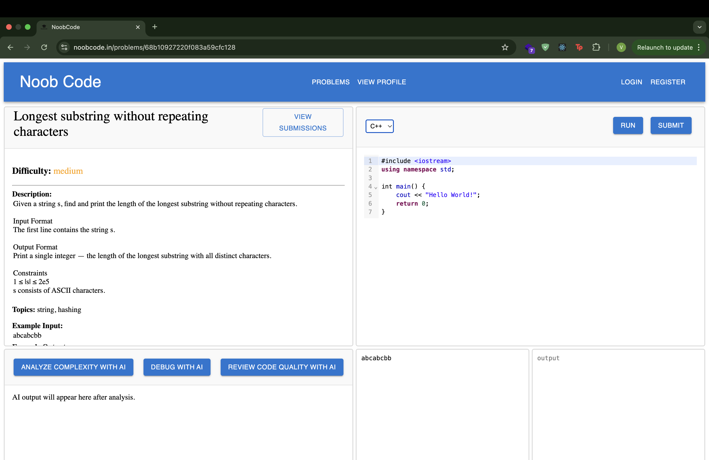

About the Project
• Developed a beginner-focused Online Judge platform that is capable of writing
code in a code editor and generating verdicts after compilation and execution
by implementing a microservice architecture.
• Integrated AI-powered debugging, complexity analysis, and code quality
feedback using Google Gemini 2.0 API to help new programmers build good
coding habits early.
• Built the online compiler for Java and C++ which is easily scalable to add
more languages.
• Used Docker to containerise the compiler service to create a secure
environment for code execution and to ensure portability.
• Additional features include – Adding problems and testcases, JWT-based
authentication and authorisation, complete submission history with submitted
code using Express, user performance tracking analytics page, mirrorcode’s
code editor, and problem filters by difficulty and topics using React.
• Deployed the compiler service on AWS EC2, backend with other functionalities
on Render, and frontend on Vercel.
• Acquired a domain name ‘noobcode.in’ from Hostinger and currently testing
with live users and improving UI.

Live deployed link
https://www.noobcode.in/

SCREENSHOTS

### Landing Pages

### Solve Problem Page

### Profile Page

### Problem List

### Submissions Page

High‑Level Architecture

  1. Frontend UI calls backend API.
  2. Backend handles auth, problems, test cases, submissions, profile, AI.
  3. Backend proxies code execution to the compiler service (COMPILER_URL).
  4. Compiler service compiles/executes code inside Docker, returns verdict/output.

  ———

Core Workflows

  1) Browse + Filter Problems

  - Frontend ProblemList.jsx calls GET /problems with query filters (difficulty, topic).
  - Backend problemController.getAllProblems builds Mongo filters and returns list.
  - Data model: Problem with title, description, difficulty, topics, example IO, createdBy.

  2) Add Problem + Testcases

  - UI: AddProblem.jsx → POST /problems/add
  - Backend problemController.addProblem saves Problem with optional creator.
  - UI navigates to AddTestcase.jsx → POST /problems/add/:id
  - Backend problemController.addTestcase saves TestCase documents.

  3) Solve (Run) Code

  - UI SolveProblem.jsx → POST /execute/run with {code, language, input}
  - Backend executeController.run forwards to compiler service /runCompiler
  - Compiler service:
      - writes code + input (generateFiles.js)
      - compiles/executes with 3s timeout (executeCpp.js, executeJava.js)
      - returns {verdict, output} or {verdict, details}
  - UI prints output or compile/runtime error details.

  4) Submit Code (Judging against Testcases)

  - UI SolveProblem.jsx → POST /execute/submit (JWT required)
  - Backend:
      - fetches testcases from TestCase
      - for each test case, calls compiler service /runCompiler
      - compares output to expected
      - on first mismatch, returns Wrong Answer
      - on compile/runtime error, returns that verdict
      - on success, marks Accepted
      - saves Solution record (code, language, verdict)
      - updates User.solvedProblems if logged in
  - UI shows verdict + count passed.

  5) AI Assistance

  - UI triggers /ai/analyzeComplexity, /ai/debug, /ai/reviewQuality
  - Backend aiController calls Gemini 2.0 Flash and returns short, formatted guidance:
      - Complexity estimate (if code seems correct)
      - Debug guidance from output
      - Code quality summary + improvements

  6) Auth + Profile

  - Auth endpoints: /auth/register, /auth/login, /auth/logout, /auth/check-auth
  - JWT is stored as HTTP‑only cookie (token)
  - Middleware verifyToken attaches req.user when token valid
  - Profile page calls GET /profile to fetch:
      - user info
      - solved problems grouped by difficulty & topic
      - created problems
      - submission history

  7) Submissions

  - UI SubmissionList.jsx → GET /submissions/:problemId
  - Backend returns Solution history (populated user name/email)

  ———

  Compiler Service Details

  - compiler/index.js is a standalone Express server.
  - Languages supported: C++, Java.
  - Code + input saved to compiler/codes and compiler/inputs.
  - Executes with a 3s timeout, returns:
      - Accepted with output
      - Compile Time Error, Runtime Error, Time Limit Exceeded, etc.
  - Docker image includes g++ and OpenJDK 17.

  ———

  Front‑End Flow

  - App.jsx wires routes for home, problem list, add, solve, profile, submissions.
  - Auth state via AuthContext.jsx.
  - Code editor is CodeMirror with C++/Java mode.
  - Charts on Profile use Recharts.

Tech Stack
	•	Frontend: React + Vite, Material UI, CodeMirror
	•	Backend: Node.js, Express.js
	•	Database: MongoDB Atlas
	•	Compiler Service: Docker-based microservice for safe execution (C++/Java)
	•	Auth: JWT + HttpOnly cookies

⸻

How It Works
	1.	 User selects a problem → writes code in editor.
	2.	 On Run, code is sent to compiler service with user input.
	3.	 On Submit, solution is tested against stored test cases.
	4.	Verdict & results are displayed instantly.

⸻

Contributing

PRs are welcome! Feel free to open issues or suggest features.